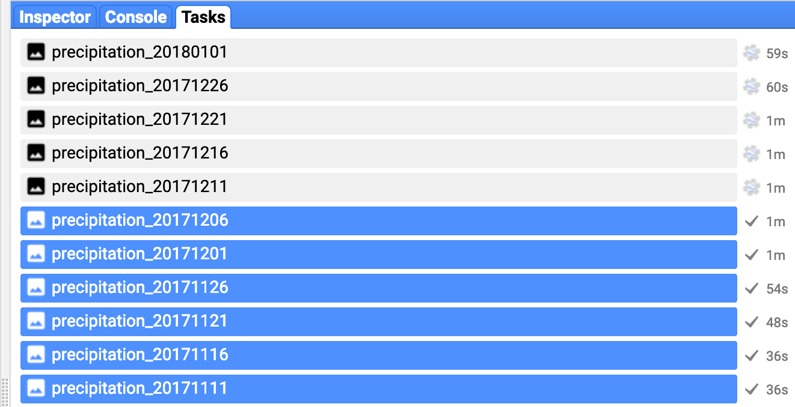

## geepy
   
Geepy is built up on Google Earth Engine's python api with a goal in mind of 
simplifying access to imagery for an area of interest. This is done by allowing
users to leverage ESRI's shapefile for cropping an image. 

Geepy also lets users download certain products for a time-series analysis. 
Images can be extracted resolution by the temporal resolution of the product
 (e.g, 16-day, pentad, 1-day...). 
     
 ##### Installation

from github:

    git clone https://github.com/adbeda/geepy
    cd geepy
    pip install e .

##### Usage

Get CHIRPS (rainfall) data with the option to export for downloading.

```python
import geepy
        
task = geepy.get_chirps("UCSB-CHG/CHIRPS/PENTAD", 
                        "../data/sample.shp", 
                        "2017-11-01", "2018-01-05", 
                         export=False)

```
     
The above script returns an image collection and if we want, for instance, 
count number of images/bands collected with in this time period, we can do:
 
```python
num = len(task.getInfo()['features'])
print(num)
```
    
    >>> 13
   
   Alternatively, we can download the product by saving the bands individually.
   This can be done with the `export=True` option and starting the downloading task. 
   
```python
task = geepy.get_chirps("UCSB-CHG/CHIRPS/PENTAD", 
                           "../data/sample.shp", 
                           "2017-11-01", "2018-01-05", 
                           export=True)

task.start()
```

If job is successfully submitted, the task    will show up
on the GEE's web-based IDE under the tab 'Task Manager'.

   
   
    
 ##### From Terminal
 
  Geepy can be accessed from terminal as well. Currently, 5 commands are supported 
  and more will be to be added to support a wide variety of products. 
  
  
       
       Usage: geepy [OPTIONS] COMMAND1 [ARGS]... [COMMAND2 [ARGS]...]...
    
            Access Google Earth Engine Products by Area of Interest
    
    Options:
      --help  Show this message and exit.
    
    Commands:
      check-features     check shapefile readiness for processing
      check-metadata     check an image product's meta data
      download-chirps    download chrips imagery by area of interest
      download-modis     download modis products in area of interest
      download-sentinel  download sentinel imagery by area of interest
 
  To replicate the above example, we can request batch download on terminal with:
  
    geepy download-chirps UCSB-CHG/CHIRPS/PENTAD data/sample.shp '2017-11-01' '2018-01-05
    
  output on console: 
  
        submitted precipitation_20171101 for downloading
        submitted precipitation_20171106 for downloading
        submitted precipitation_20171111 for downloading...
        
  
  